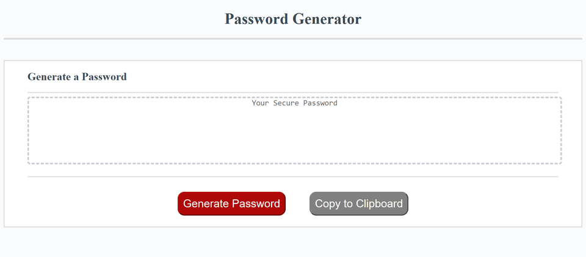

# password_generator
Name:
Password Generator

Descripton:
It is an application that generates a random password based on user-selected criteria. This app will run in the browser and feature dynamically updated HTML and CSS powered by your JavaScript code.

The user will be prompted to choose from the following password criteria:

Length (must be between 8 and 128 characters)

Character type:

Special characters 
Numeric characters
Lowercase characters
Uppercase characters

The application should validate user input and ensure that at least one character type is selected. Once the password is generated it writes to the page. You can also copy the password to clipboard.

Visuals:

Here is the screenshot:

Installation:

This webpage is available as my github page whose link is https://saranyav91.github.io/password_generator/

Usage:

This is, as mentioned earlier, a password generator. Also, this webpage can be accessed from different devices of varied resolutions, whithout any issue in the page outlook and navigation.

Support:

Contact me, Saranya Vasudevan at sara.29891@gmail.com